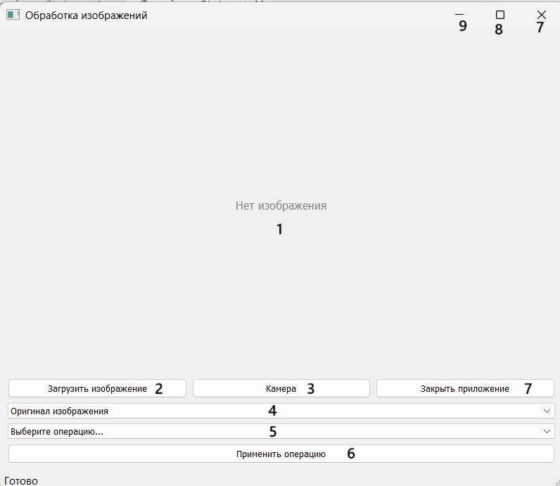

# Описание приложения

Это приложение для обработки изображений, разработанное на Python с использованием библиотеки PyTorch. Оно позволяет загружать изображения из файла или делать снимки с веб-камеры, а затем применять к ним различные операции обработки.

# Установка

1. Клонируйте репозиторий:
git clone https://github.com/riiiiian/summer_pract.git
cd summer_pract
2. Создайте и активируйте виртуальное окружение:
python -m venv имя_окружения
имя_окружения\Scripts\activate
3. Установите библиотеки:
pip install -r requirements.txt

# Запуск

Происходит через команду: python main.py

# Основные возможности

1. Загрузка изображений (PNG, JPG)
2. Работа с веб-камерой (создание снимков)
3. Отображение отдельных цветовых каналов (RGB)
4. Операции обработки изображений: Негативное преобразование, Понижение яркости, Рисование красных кругов

# Структура проекта

summer_pract/
├── main.py              # Основной скрипт приложения
├── requirements.txt     # Список библиотек
└── README.md            # Этот файл

# Интерфейс

Описание кнопок:
1. Место для загруженного изображения или снимка
2. Кнопка, которая загружает выбранное изображение
3. Кнопка, которая включает камеру и делает снимок
4. Кнопка для смены цветового канала
5. Кнопка для выбора операции обработки изображения (Основные возможности - Пункт 4)
6. Кнопка, которая выполняет операции обработки изображения
7. Кнопки закрытия приложения
8. Кнопка открытия окна на весь экран
9. Кнопка, которая скрывает окно приложения

